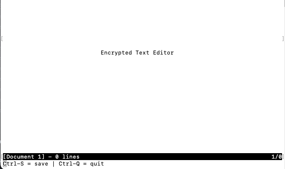
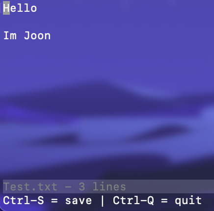

# SoftSys Encrypted Text Editor

## About
A terminal-based text editor that encrypts the file when saving and decrypts it when opens the existing file.

## Table of Contents
>   * [About](#about)
>   * [Table of contents](#table-of-contents)
>   * [Running the Text Editor](#running-the-text-editor)
>   * [Features](#features)


## Installation

1. Clone the repo to a file
```bash
https://github.com/joon628/Encrypted-Text-Editor.git
```

## Running the Text Editor
Compile with 

```bash
gcc text_editor.c -o text
```
And run the text editor using

```bash
./text
```

## Features
Users can see the special key to quit or save, the file name, and how many lines they have.



Users can write their documents in the text editor!



When saved, the file is encrypted.


