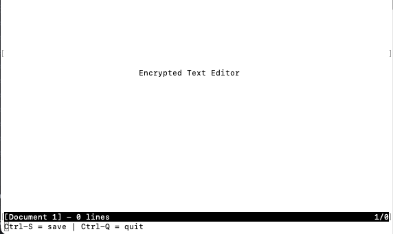
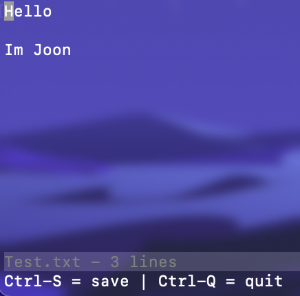

# **Encrypted Text Editor**

## Not Siblings, but Kangs
*Joon Kang, Mari Kang*

## *Goals for the Project*

The goal of this project is to create a functioning text editor that encrypts and decrypts a text file when it is created and saved. To achieve this goal, we need two separate components - the first is to create a text editor that can create, edit, open and save text documents. The second part of this project will implement an encryption system that will encrypt all text files the editor creates, edits and saves. The lower bound of this project will be the creation of the text editor, and the completion of it's functionalities. If this is met and we have the capacity to go further, we will implement a system whee the text within the file is automatically encrypted when it is saved so that no other text editor other than this one can open it.

## *Learning Goals from the Project*

The learning goals of this project is to understand how C works in a broader spectrum, as well as being able to learn more about how C works with encryption and decryption. Working on this project with a structured C with header files and clean code will allow us to work on projects and code in a more structured and balanced manner. Also, working on cryptography will open up a new realm of learning for us as we do not know a lot about this topic. We know the very basics of cryptography and its diverse methods, so we would like to focus on learning more about it and its implementation in C.

## *Code Implementation*

### Enable/Disable Raw Mode

We implemented two functions that each enables and disables the raw mode in the terminal. The default mode of terminal is canonical mode, and the keyboard input is sent only when the user presses enter in this mode. In order to get the user input byte-by-byte, we had to change into raw mode. 

```
void startRawMode() {
    if (tcgetattr(STDIN_FILENO, &T.orig_attribute) == -1) error_exit("tcgetattr");

    //Call endRawMode when the program exits.
    atexit(endRawMode);

    //Save a copy of terminos struct in its original state.
    struct termios raw = T.orig_attribute;

    raw.c_iflag &= ~(BRKINT | ICRNL | INPCK | ISTRIP | IXON);
    raw.c_oflag &= ~(OPOST);
    raw.c_cflag |= (CS8);
    raw.c_lflag &= ~(ECHO | ICANON | IEXTEN | ISIG);

    //Set the minimum number of bytes of input needed to 0 so that read() returns
    //as soon as there is any input to be read.
    raw.c_cc[VMIN] = 0;
    //Set the maximum amount of time to wait before read() returns.
    raw.c_cc[VTIME] = 1;

    if (tcsetattr(STDIN_FILENO, TCSAFLUSH, &raw) == -1) error_exit("tcsetattr");
}
```

This function allows to switch to raw mode so that we can process each keypress. Also, we use multiple flags to turn off or change some of the terminal's attributes including Ctrl signals. Changing several existing functionalities in terminal was one of the most significant parts of our project because how terminal handles the input is different from how the input is written in the text editor. Also, this function calls endRawMode when the program exits so that the terminal attributes go back to default state. 

### Update Row
There are multiple functions related to updating row, including inserting or deleting characters from the current row. When inserting a character, we call a function insertChar() that takes a single character as an argument. 

```
void insertChar(int c) {
    //Append new row to the file when the cursor is on the last line.
    if (T.cursor_y == T.numrows) {
        insertRow(T.numrows, "", 0);
    }
    //Insert the character.
    insertCharFromKey(&T.row[T.cursor_y], T.cursor_x, c);

    T.cursor_x++;
}
```
The function first checks if the cursor is on the last line and add a new row at the end. Then, it inserts the character to the position where cursor is at using insertCharFromKey() function. After inserting a character, it moves the cursor forward because new character is added.

### Save File
We use saveFile() function to save a file. To save a file, we need to first check if it's an existing file or a new file. If it's not an existing file, the filename will be NULL to we should ask user what the name of the file should be. getNewFileName() function gets the user input and put into filename variable. If the filename is still NULL after getting the user input, it is considered as cancellation of saving documents so the funcion returns. If filename exists, we then change the context of the documents into string using rowsToString() function, and writes the string to the file after opening the file.
```
if (T.filename == NULL) {
    T.filename = getNewFileName("Save as: %s (ESC to cancel)");
    if (T.filename == NULL) {
        updateStatusBar("Save aborted");
        return;
    }
}

int len;
//Change the contexts into string.
char *buf = rowsToString(&len);
```
### Open Existing File

Depending on whether the program is called with or without an argument, the program either opens an existing file or creates a new file. The program checks if there's any argument in the main function.

```
if (argc >= 2) {
        openFile(argv[1]);
    }
```
If there's an argument, it means that there's a existing file that the user wants to open, so the program calls openFile() function. In the openFile() function, the argument is set to the filename variable and opens the file. 

```
while ((linelen = getline(&line, &linecap, fp)) != -1) {
    while (linelen > 0 && (line[linelen - 1] == '\n' ||
            line[linelen - 1] == '\r'))
        linelen--;

    //Append the current row.
    insertRow(T.numrows, line, linelen);
}
```

Using getline(), the program gets line by line from the opened file, find the length of the row, and insert the content in the row to the text editor terminal. Here, we are reducing the linelen until the last character is '\n' or '\r' to find the exact length of the row.

### Encryption / Decryption
We implemented a simple encryption to add 3 to ASCII value when encrypting. When saving the file in saveFile() function, 3 is added to each ASCII value of the character.

```
for(i = 0; (i < 1000 && buf[i] != '\0'); i++){
    if (buf[i] != '\n'){
        buf[i] = buf[i] + 3; //the key for encryption is 3 that is added to ASCII value
    }
}
```

And similarly, we subtracted 3 to ASCII value when decrypting when opening the existing file.

```
for(i = 0; (i < 1000 && line[i] != '\0'); i++){
    if (line[i] != '\n'){
        line[i] = line[i] - 3;
    }
}
```
## *Output*

We have managed to implement a text editor that runs in C with bare minimum functions of editing and saving. We have also managed to implement a function that allows the encryption of the content that is written in the text editor when it is saved. This way, the text editor will be able to save a file that no other text editors can comprehend. We used a simple ASCII code edit method for encryption and decryption, as other methods required a far more complicated and heavy computing methods of encryption. The program allows us to open/create a file, then save it with an automatic encryption. However the user of the text editor does not know this because the text editor always decrypts the files that it opens. All in all, the text file generated with this text editor cannot be viewed with any other text editors but this one.



When the program run, we can see the name of our text editor in the middle and the cursor is located in the top-left corner. The second to last line is a status bar that shows the name of the file and how many lines are written. The last line contains the message bar, and currently it tells the user the keys that users can use to save or quit.

The user can write, delete, and move cursor around in the text editor. When user is done with editing, the file can be saved using Ctrl-S. Below is the example of the file and how it is encrypted.




## *Design Decisions*

One of the big design decisions that we have made throughout this project was the implementation of the encryption and decryption of the text files. It was possible to have a type of key or password that would be created for every text file to encrypt and decrypt, but we decided that this would be troublesome in terms of using the text editor, as the keys might get lost, and we have no way of retrieving that key. Our design decision was to implement a simple encryption that would allow a set key to adjust each individual character in the text file so that it would be incomprehensible to people who try to read it from a different text editor. Of course, this does come with a catch that this text editor is unable to read other text files from other text editors as well, because it would decrypt the files in the same way as it would with a file that the program generated. However we deemed this trivial because our goal was to create a text editor that could generate and read text files that only could be read by itself.

## *Reflection*

In the end, our project was right where we wanted it to be. We managed to create 2 components to the project. The text editor works well in terms of being able to open/create text files, save the files and write to them as we would on a normal text editor. The encryption also works in terms of the texts in the document being incomprehensible for others to read once the document is saved. We have gone a step further by implementing the automation of the encryption, so that there is no extra steps in having to encrypt a file when saving the document. With that, we have achieved all the goals that we had in the goals for the project. In terms of our learning goals, we managed to understand a little more about how C works. We managed to find how to implement multiple different types of encryptions in C, although we did end up using the most simple method of encryption. Throughout our process, we discussed and tested with 3 different types of encryption and decryption - AES, RSA and ASCII replacement. We were able to study how each of these encryption/decryption worked in C, which was one of our learning goals. 

We would have liked to improve or add an extension to our existing project if we had more time, however. It would be great to see a method of choosing your own method of encryption, and a method to indicate whether or not the text is encrypted, so that other texts can also be read in this text editor program. Also, being able to implement other functions like searching would also be a huge extension that we would like to explore further on a later date.

## *Resources*

The following links are the resources we used for our project.

- [A Simple Text Editor](https://github.com/kyletolle/texor)
- [Build Own Text Editor](https://viewsourcecode.org/snaptoken/kilo/)
- [Encrypt and Decrypt String](http://www.trytoprogram.com/c-examples/c-program-to-encrypt-and-decrypt-string/)
- [C-editor](https://github.com/bl4de/c-editor/blob/master/kilo.c)
